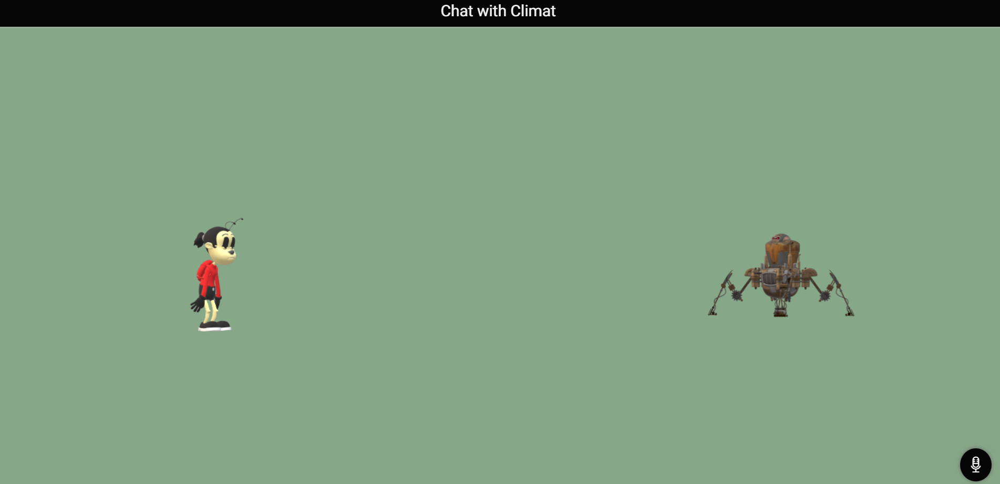

# climat---your-Climate-change-tackling-partner
  * Climat is a speech/voice based chat bot. which receives speech/voice from the sender and uses keyword to sense the context of the speech/voice and reply's accordingly.
  
  
# Future for Climat
  * I completed this project within the time frame of 120 minutes, so the UI/UX is one the worst ever i have seen. in future the UI/UX will be improved.
  
  
  
  
# Stack Used : 
   * Html
   * Css
   * Javascript
   
   
 # Screenshots of the project ⬇️
 
 
 
 
# Live demo :
   * link - https://relaxed-turing-7b6ede.netlify.app/
